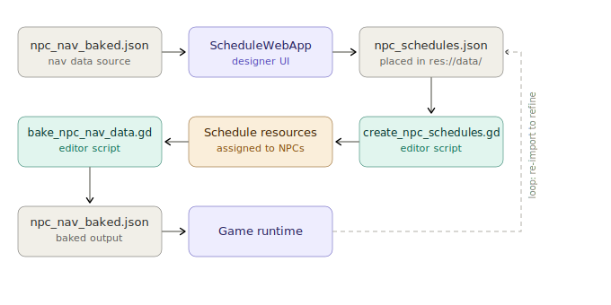

# Schedule Web App

A browser-based tool for creating and editing NPC schedules for our Godot game. The app produces a JSON file that is automatically converted into Godot resource files, ready to be baked into the game's navigation data.

## Overview

Designing NPC daily schedules with conditions (specific days, unlocked flags, friendship levels) becomes unwieldy in Godot's inspector. The **Schedule Web App** provides a visual editor where you can:

- Select any NPC that exists in your project.
- Set up multiple schedule entries, each with an optional activation condition.
- Add time-based points with target scenes and nodes, and optional per-point conditions.
- Use a palette of condition types (Day, Weekday, Flag, Friendship, AND/OR/NOT) to build complex scheduling logic.
- Import the current project's NPC list, scene names, and target points directly from the baked navigation JSON.
- Import an existing `npc_schedules.json` to continue editing.

The app then exports a clean `npc_schedules.json` that fits perfectly into the Godot pipeline.

## Pipeline

The complete workflow from web app to runtime:



1. **Web App** – design schedules and export `npc_schedules.json`.
2. **Godot Editor Script** – `create_npc_schedules.gd` reads the JSON and generates a `.tres` resource for each NPC inside `res://schedules/`.
3. **Baking** – the regular `bake_npc_nav_data.gd` scans all scenes, including the NPC nodes that now reference the generated schedule resources, and creates `npc_nav_baked.json`.
4. **Runtime** – `NPCNavLoader` loads `npc_nav_baked.json`, which contains the schedule resource paths; `load()` reconstructs the full condition tree instantly.

All schedule logic is converted to native Godot resources **before** the game runs – no JSON parsing at runtime.

## Input Files (used by the web app)

### `npc_nav_baked.json`

_Generated by `bake_npc_nav_data.gd`._  
The web app uses it to provide accurate dropdowns and validation:

- **NPCs** – list of all NPC ids and their home scenes.
- **Target Points** – valid relative node paths per scene (e.g. `"Farm/House/Bed"`).
- **Scenes** – mapping of integer scene IDs to human-readable names (you can add a `scene_name` field in the baker, or the app can use its own internal map).

Drag and drop this file into the app when starting a new editing session, or to update the project data.

### `npc_schedules.json` (optional)

If you previously exported a schedule file, import it to continue editing. All existing entries, conditions, and points will be loaded.

## Output File

### `npc_schedules.json`

The web app exports a file that must be placed at `res://data/npc_schedules.json` in the Godot project. Its format exactly matches what `create_npc_schedules.gd` expects.

See the [JSON structure reference](#json-structure) below.

## Condition System

Conditions are the building blocks for dynamic scheduling. They evaluate against the game state at runtime.

### Available condition types

| Type                  | Fields                                     | Description                                   |
| --------------------- | ------------------------------------------ | --------------------------------------------- |
| `DayCondition`        | `day` (int)                                | True if current day is exactly `day`          |
| `WeekdayCondition`    | `weekday` (int, 0=Sun…6=Sat)               | True if current weekday matches               |
| `FlagCondition`       | `flag_name` (string)                       | True if a game flag is set                    |
| `FriendshipCondition` | `npc_id` (string), `required_hearts` (int) | True if player has enough hearts with the NPC |

### Composition

Combine conditions with:

- `AndCondition` – all sub-conditions must be true.
- `OrCondition` – at least one sub-condition must be true.
- `NotCondition` – inverts a single condition.

Conditions can be nested arbitrarily deep.

### Usage in schedules

- **Entry level** – if the condition is true, that entry's points are active for the day. The _first matching entry_ wins.
- **Point level** – a point only fires if its condition is also true at that moment.

## Example JSON

```json
{
  "npc_schedules": [
    {
      "id": "martha",
      "entries": [
        {
          "entry_condition": {
            "type": "AndCondition",
            "sub_conditions": [
              { "type": "DayCondition", "day": 3 },
              { "type": "FlagCondition", "flag_name": "player_met_martha" }
            ]
          },
          "points": [
            {
              "time": 800,
              "scene": 0,
              "target_node": "Farm/House/Bed",
              "point_condition": null
            },
            {
              "time": 1200,
              "scene": 1,
              "target_node": "FarmerHouse/Kitchen/Table",
              "point_condition": {
                "type": "FriendshipCondition",
                "npc_id": "player",
                "required_hearts": 5
              }
            }
          ]
        },
        {
          "entry_condition": null,
          "points": [
            { "time": 900, "scene": 0, "target_node": "Farm/Field/Plot1" }
          ]
        }
      ]
    }
  ]
}
```
